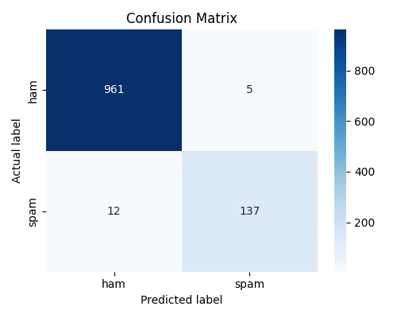

# SMS Spam Classifier

A beginner-friendly machine learning project that classifies text messages as **spam** or **ham** (not spam) using Multinomial Naive Bayes.

Built as a college project for **CS (AI & ML)** coursework at PES University.

## Results

- **Accuracy:** 98.48%
- **Precision (spam):** 96%
- **Recall (spam):** 92%



## How it works

1. **Dataset** — 5,572 real SMS messages from the public "SMS Spam Collection" dataset, each labeled `ham` or `spam`.
2. **Preprocessing** — labels encoded to 0/1, data split 80/20 into train/test sets.
3. **Vectorization** — messages converted to word-count vectors using `CountVectorizer` (Bag of Words), with English stop words removed.
4. **Model** — `MultinomialNB` (Multinomial Naive Bayes) trained on the vectorized training set.
5. **Evaluation** — accuracy, precision/recall, and a confusion matrix computed on the held-out test set.

## Project structure

| File | Description |
|---|---|
| `spam_classifier.py` | Core script — trains and evaluates the model, cell-by-cell (`# %%` markers for Colab/Jupyter) |
| `spam_gui.py` | Desktop GUI version built with Tkinter — type a message, get an instant spam/ham verdict |
| `sms_spam_dataset.tsv` | The dataset (tab-separated: `label`, `message`) |
| `confusion_matrix.png` | Visualization of model performance on the test set |

## How to run it

### Option 1 — Notebook (Google Colab / Jupyter)
1. Upload `sms_spam_dataset.tsv` to your Colab session (or place it next to the notebook in Jupyter).
2. Open `spam_classifier.py` — each `# %%` marks a new cell. Paste them into Colab/Jupyter cells in order and run top to bottom.

### Option 2 — Desktop app (Tkinter)
Requires Python 3 with `pandas` and `scikit-learn` installed locally:
```bash
pip install pandas scikit-learn
python spam_gui.py
```
Make sure `sms_spam_dataset.tsv` is in the same folder as `spam_gui.py`. A window will open where you can type any message and click "Check Message" to classify it.

## Tech stack

- Python 3
- pandas — data loading and handling
- scikit-learn — vectorization, model training, evaluation
- matplotlib + seaborn — confusion matrix visualization
- Tkinter — desktop GUI (standard library, no install needed)

## License

MIT — see [LICENSE](LICENSE).
